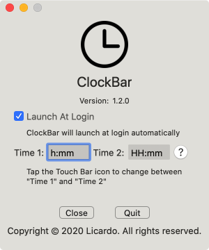

# Clock Bar

Get clock right on the sweetest spot of the macbook, on the touch bar.

### Screenshots

### Why

The upper right corner seems the farthest place on the planet to look at. Full of menu items, but an area you really find it incovenient. Touch bar has been so convenient for so many things that you want to have everything right there. Having the clock right on the touch bar save you from visiting the darkest corner and saves so much effort. Seriously!!! You will realise.

### Ideas for development

If you have any ideas that can help us improve this application, please create a new issue.

### How to contribute

- Download Xcode
- Fork this repository
- Open repository via Xcode
- Make changes
- Provide Pull Request

### Thanks for passing by

---

Made by Licardo
