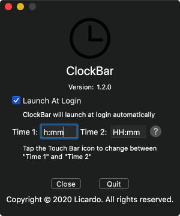

<h1 align="center">Welcome to ClockBar 👋</h1>

  
  
  
  
  

> Get clock right on the sweetest spot of the macbook, on the Touch Bar.

### 🏠 [Homepage](https://github.com/L1cardo/ClockBar)

## Announcement

ClockBar is developed by a medical student, so please kind to me!

## Screenshots

## Why

The upper right corner seems the farthest place on the planet to look at. Full of menu items, but an area you really find it incovenient. Touch bar has been so convenient for so many things that you want to have everything right there. Having the clock right on the touch bar save you from visiting the darkest corner and saves so much effort. Seriously!!! You will realise.

## Author

👤 **Licardo**

* Website: https://github.com/L1cardo
* Twitter: [@AlbertAbdilim](https://twitter.com/AlbertAbdilim)
* Github: [@L1cardo](https://github.com/L1cardo)

## 🤝 Contributing

Contributions, issues and feature requests are welcome!
Feel free to check [issues page](https://github.com/L1cardo/ClockBar/issues).
Welcome to pull request.

## Show your support

Give a ⭐️ if this project helped you!

## 📝 License

Copyright © 2019 [L1cardo](https://github.com/L1cardo). 
This project is [MIT](https://raw.githubusercontent.com/L1cardo/ClockBar/master/LICENSE) licensed.
